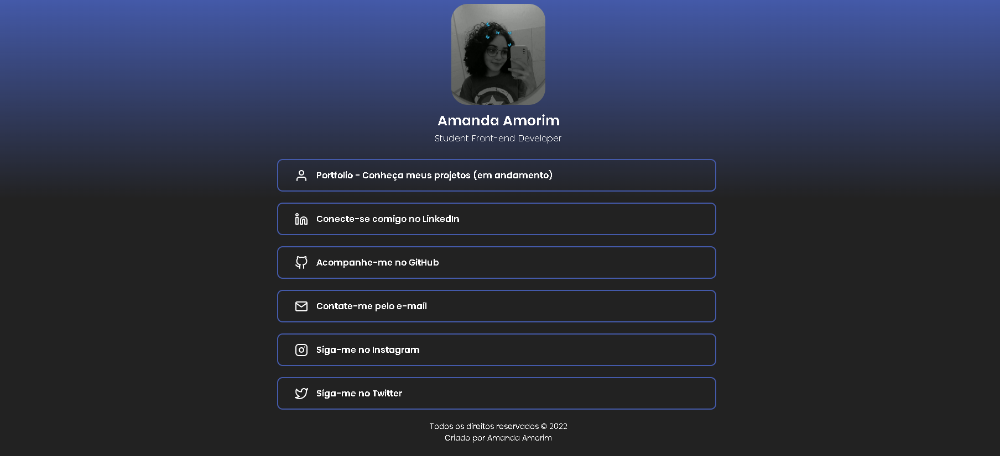

# Site de Links |HTML e CSS.

Projeto para portfólio: site com meus links de contato links. Página feita na IDE Visual Studio Code com HTML e CSS.  
Para acessá-lo, <a href="https://amandavsadev.github.io/site-de-links/"> Clique aqui</a>!</li>

